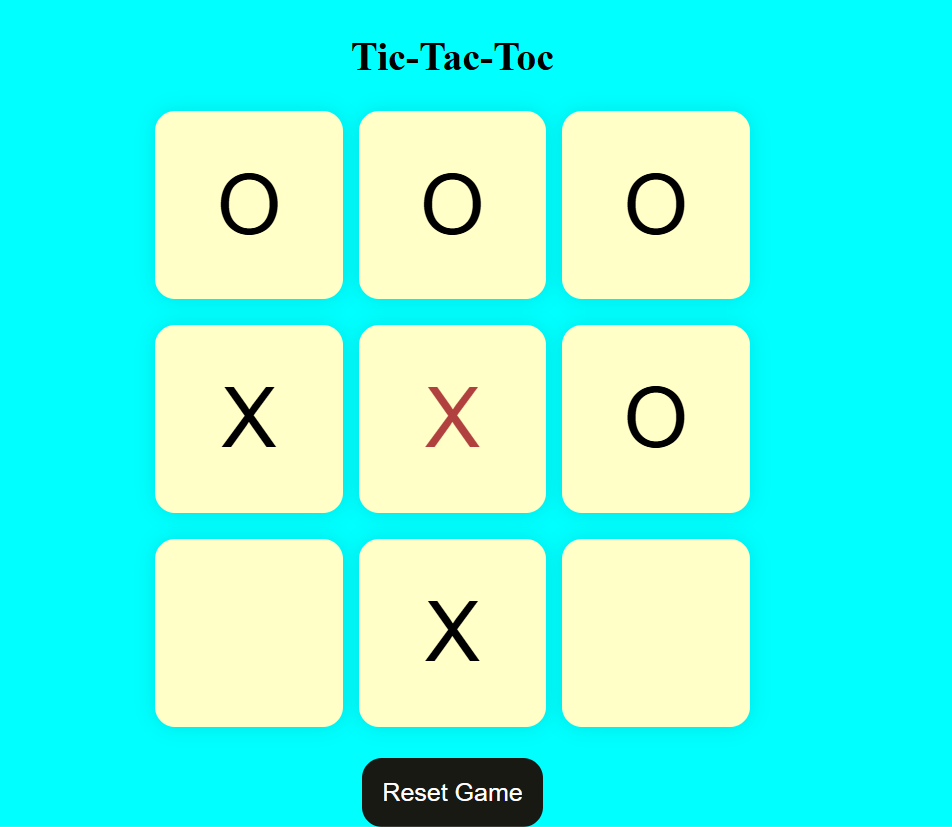
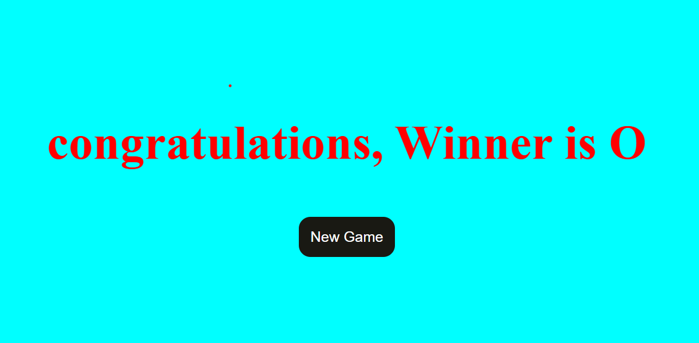

# TIC-TAC-TOC_GAME-HTML_CSS_JS

## ❌⭕ Tic-Tac-Toc Game Description

 #### Tic-Tac-Toc (also known as Noughts and Crosses) is a classic two-player game played on a 3×3 grid. Players take turns marking the spaces with X or O, and the first to align three of their marks horizontally, vertically, or diagonally wins.

### 🎮 Features:

#### - Interactive 3×3 grid
#### - Two-player turn-based logic
#### - Win detection and draw condition
#### - Game reset functionality
#### - Simple and responsive design

### Output 1

### Output 2

